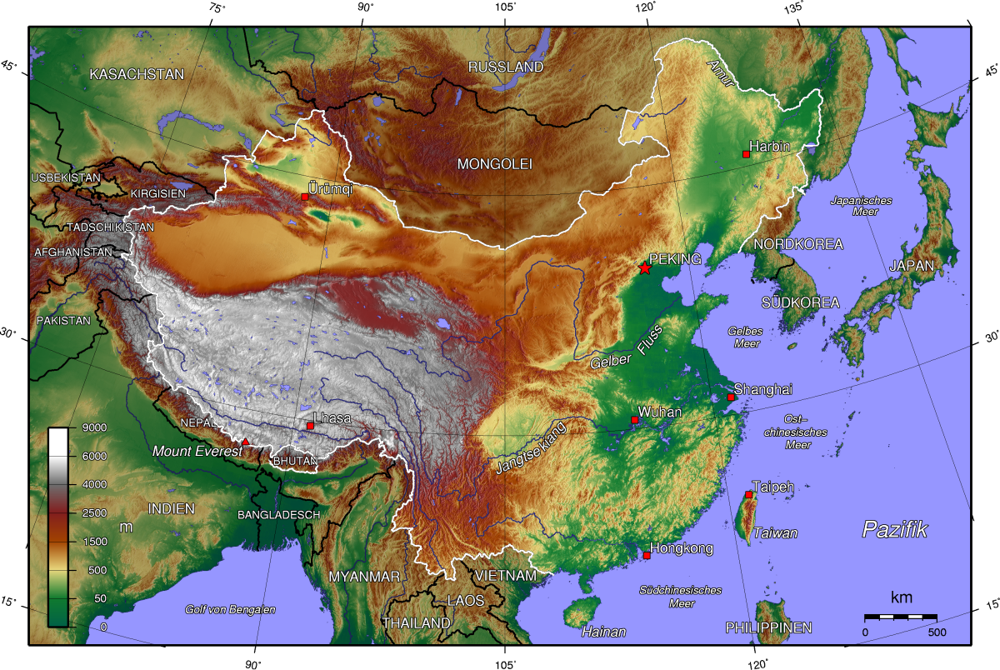

# China

China ist ein außerordentliches Land, so weitläufig, vielfältig und voller Geschichte und Kultur. In den westlichen Ländern der Erde wird meist nur Kritik an der Politik Chinas ausgeübt und allgemein ein negatives Bild gezeichnet, nur selten kommen die Wunder dieses Landes zu Thema. In diesem Kaptiel geht es vor allem um allgemeines Wissen über China, auch vor allem im geographischen Sinne. Dabei ist das Wissen hier sehr reduziert und dient mehr als Anhaltspunkte, die aber sehr lehrreich und interessant sind.

### Das Qinghai-Tibet-Plateau

Die Naturräume Chinas werden massiv vom Qinghai-Tibet-Plateau geprägt. Es ist die höchste Erhebung der Erde und hat sich wohl vor ca. 65-55 Mio Jahren gebildet. Entstanden ist es durch Plattenkollision der indischen und der asiatischen Platte. Dabei bewegte sich die indische Platte nach Norden und dies führte zu einer Stauchung der Platten und Bildung des Plateaus. Es ist mit rund 40.000 Gletchern ein immenser Wasserspeicher, welcher die meisten Flüsse Chinas speist. Außerdem beeinflusst die Erhebung die Monsumaktivität und die allgemeinen Wetterverhältnisse. Warme Luft steigt bekanntlich nach oben und so zieht das Qinghai-Tibet-Plateau Luft vom Pazifik und vom indischen Ozean an und erhöht damit die Niederschläge im Süden und Osten Chinas. Der Norden verbleibt mit weniger Niederschlag, da hier kein Meer ist, wovon Wolken/Wasser angezogen werden könnte. China kann man sich wie eine Treppe mit 3 Stufen vorstellen. Das Qinghai-Tibet-Plateau bildet die höchste Stufe mit einer Höhe über 4000 Meter. Danach fällt es ab den Kunlun-, Qilian-, und Hengduan-Bergen in Nord-Osten ab, auf ca. 1000 bis 200 Höhenmetern. Es ist eine Reihe von Hochebenen und Becken. Im Osten ist die unterste Stufe, welche aus Ebenen und Hügeln besteht. Diese 3 Höhenstufen sind ausschlaggebend für die dort vorherrschende Naturräume (Wüste, Gletscher, ...).

Folgende Höhenabbildung Chinas zeigt diese 3 Höhenstufen gut. Im Südwesten befindet sich das Qinghai-Tibet-Plateau und nach Nord-Osten fällt die Landschaft immer weiter ab. Abbildung entnommen von [https://de.wikipedia.org/wiki/China](https://de.wikipedia.org/wiki/China).

</img>

